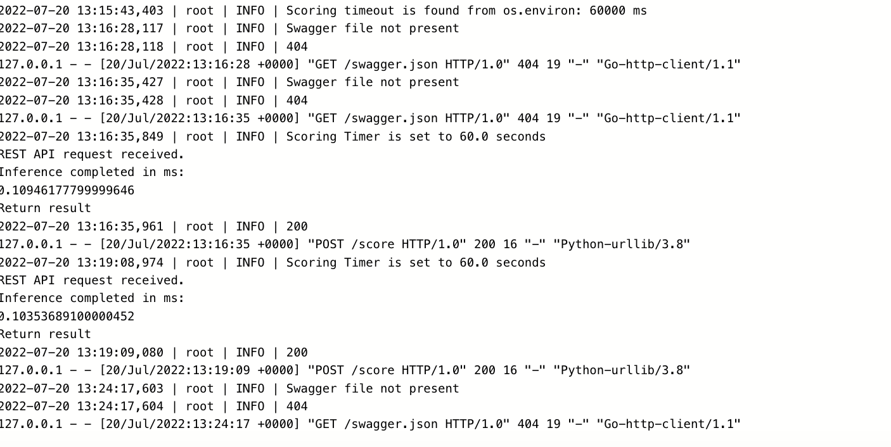
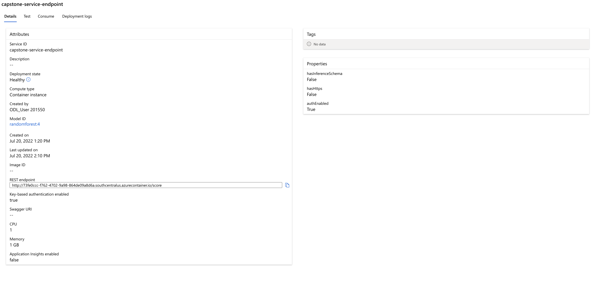
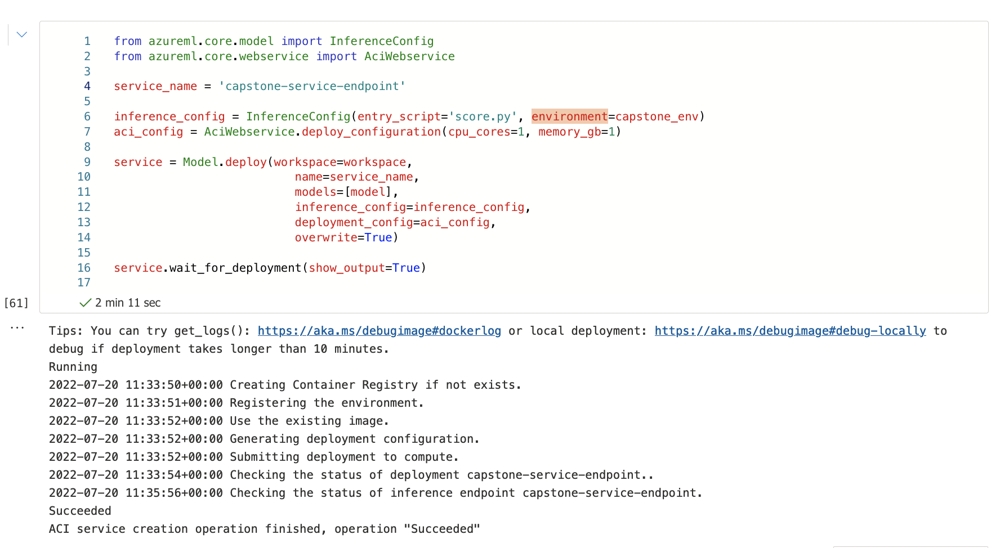
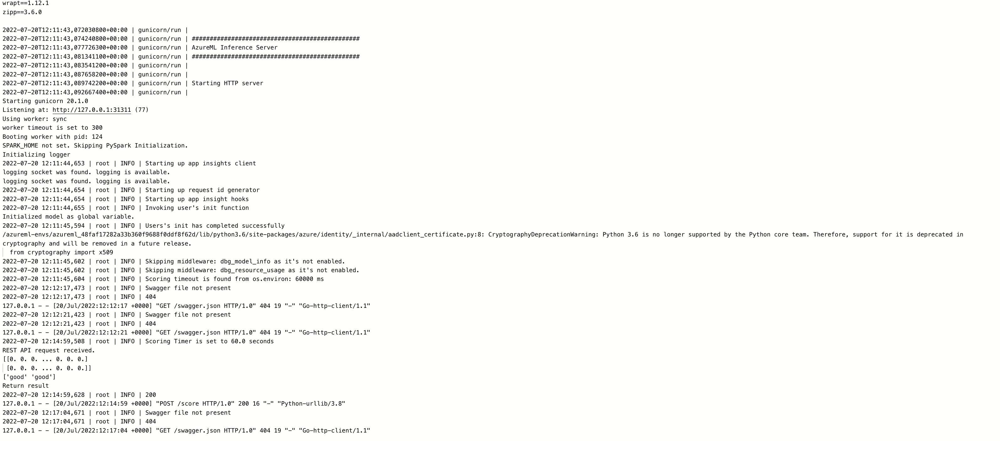
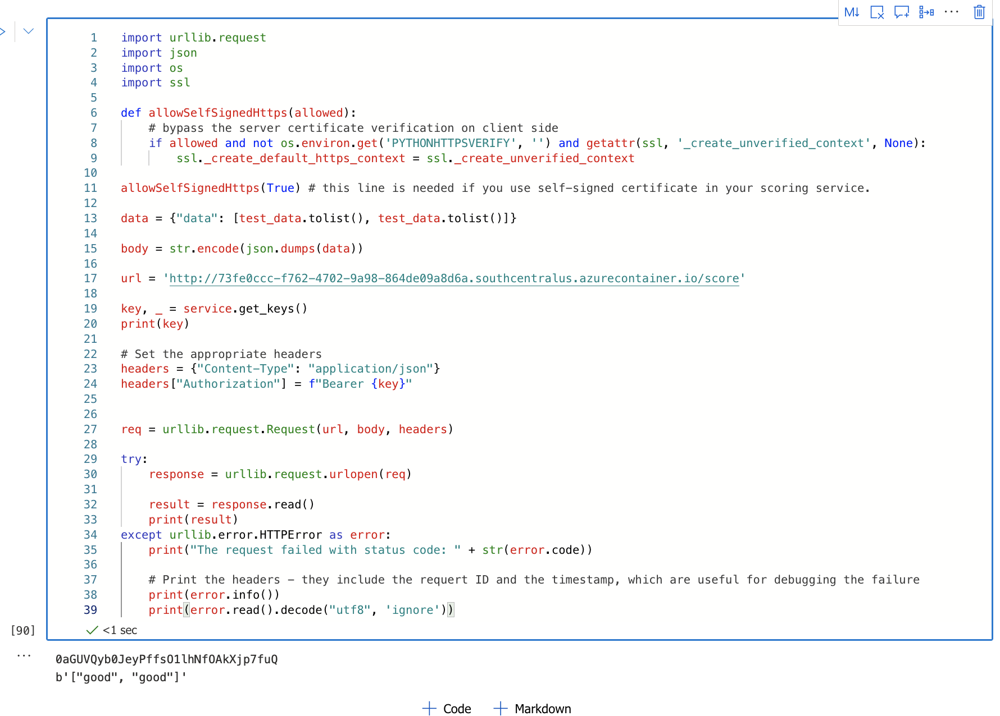
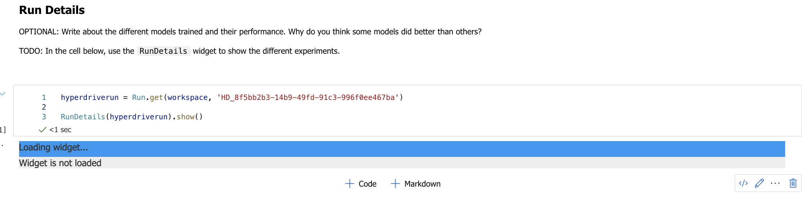
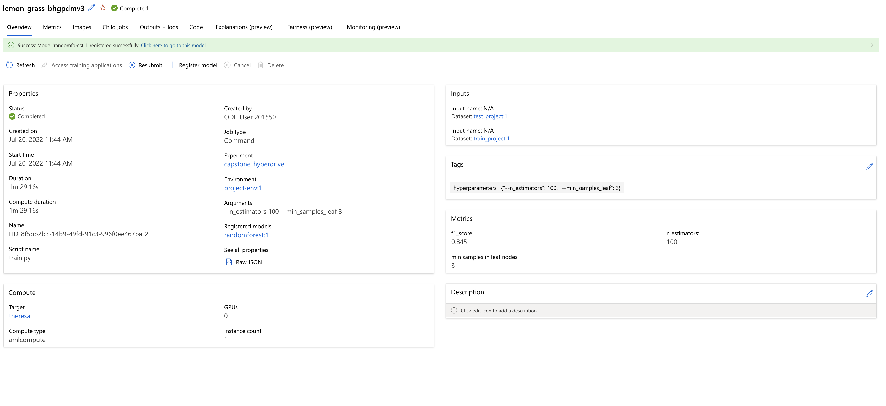
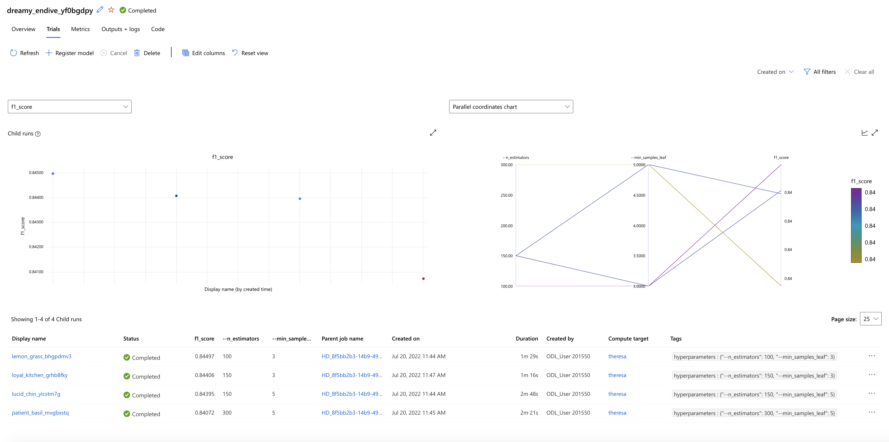

# Customer Feedback classification stacking classifier training

This project tries to find the best model that serves as the final prediction step in a stacking approach.
The original data was customer feedback, to avoid disclosing the data only the predictions of the level0 classifiers
are given as input data during training.

## Project Set Up and Installation
*OPTIONAL:* If your project has any special installation steps, this is where you should put it. To turn this project into a professional portfolio project, you are encouraged to explain how to set up this project in AzureML.

## Dataset

### Overview

The data serving as input are already outputs of other models they are predicted probabilities over classes defined 
by level0 predictors, Since the problem is something I already work on for my company I do not want to disclose all details but level0 predictors are including models trained on Sentence embeddings and Custom embeddings on discriminative features identified during exploration, Furthermore a Bag of Words model on a vocabulary derived on frequent patterns present in each class was derived. This is data I generated for a classification problem with a large number of classes as well as high imbalance in the data. The small classes where already upsampled using SMOTE and large classes where downsampled using the imbalance learn libraries downsampling Clustercentroids Method.

### Task

The task is to train a classification model that classifies the correct code by using different datasets that are labeled either by domain experts or through weak supervision i.e. rule based labeling. The transfer of the model should
result in a better classification of a validation dataset of the weak supervised data.

### Access

The data is uploaded in the 

## Automated ML

Since the data is imbalanced and we are more interested in precision
than recall we use average precision score weighted i.e. how often are the recalled elements actually
member of the predicted class. 
We turn featurization off, as we already use predictions of another morel hence I would like for this
stacking approach just to understand if there is a better classifier than the random forest for my purposes.
Feature engineering is much more complex (few shot learning algorithm predictions based on transformer based embeddings
etc.) in this data than what I would expect from an automl solution
so we can save the computing resources.

automl_config = AutoMLConfig(
    experiment_timeout_hours=1.0,
    task= 'classification',
    primary_metric= 'average_precision_score_weighted',
    enable_early_stopping= True,
    featurization='off',
    X =X_train,
    y = y_train, 
    X_valid = X_val, 
    y_valid = y_val,
    enable_voting_ensemble=False,
    enable_stack_ensemble=False,
    allowed_models=['KNN', 'SVM', 'XGBoostClassifier'],
    y_min= 100,
    y_max= 1200,)

Because of the size of the Dataset and the lack of performance of the azure cluster, I had to reduce it to three algorithms to test KNN, SVM and XGBoostClassifier. 

### Results
*TODO*: What are the results you got with your automated ML model? What were the parameters of the model? How could you have improved it?

The best model 

*TODO* Remeber to provide screenshots of the `RunDetails` widget as well as a screenshot of the best model trained with it's parameters.

That is impossible on these machines, it once worked, and then never again...

## Hyperparameter Tuning

I chose a random forest for the hyperparameter tuning experiment cause a simple classifier is usually sufficient
as a level1 predictor in a stacking approach. At the same time the large number of classes can be handled via
the number of decision trees. 
I chose bayesian optimization to make each successive trial based on the best parameters of the previous trial.

The parameters are:
min_samples_leaf: the minimum number of samples required in a leaf, will also influence the depth of the trees. choice(3, 5, 10, 20), Again since it influences the depth of the trees it can lead to either overfitting or underfitting, It is considerably smaller than the smallest class size in order to force it to build multiple trees per class.

n_estimators: The number of decision trees in the Random forest. choice(100, 150, 300, 500), To see when we get into an overfitting regime I start from as few as 100 trees to as many as 500.
class_weight: indicating the imbalanced nature of the problem.

### Results

The best model had 100 Decision trees in a random forest, with minimum samples per leave being 3 and a performance of 84.4%.

That is impossible on these machines, it once worked, and then never again...

## Model Deployment

The REST request needs to contain an array with 1789 dimensional inputs, which is the feature diemnsionality of
the dataset. Then the output will be one of the labels the model was trained on. 
For example if arrays of all 0 are passed the response should be 'good'.

## Screen Recording

https://studio.youtube.com/video/DmXcPiw22Uo/edit909481

## Standout Suggestions

I implemented logging of the inference time to make up for the missing knowledge of whether the automl solution was actually better and deployed instead by default the hyperdrive solution.

See the file for the inference time logging:

# Other images requested

